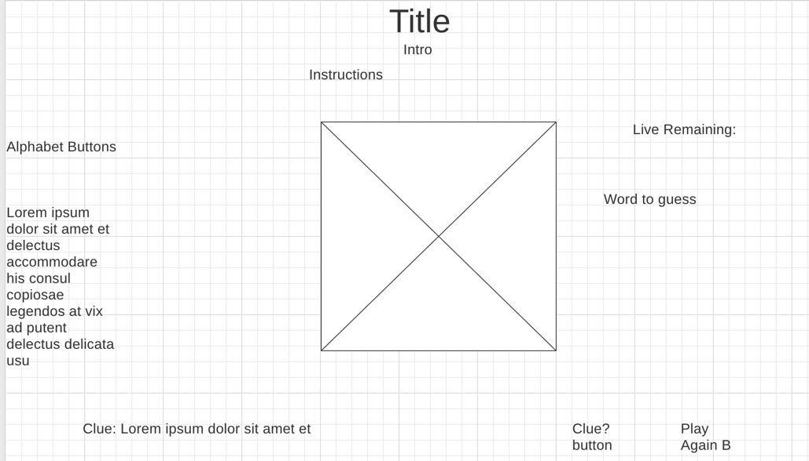
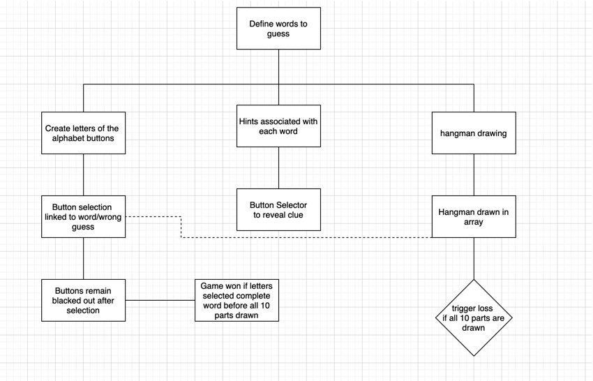
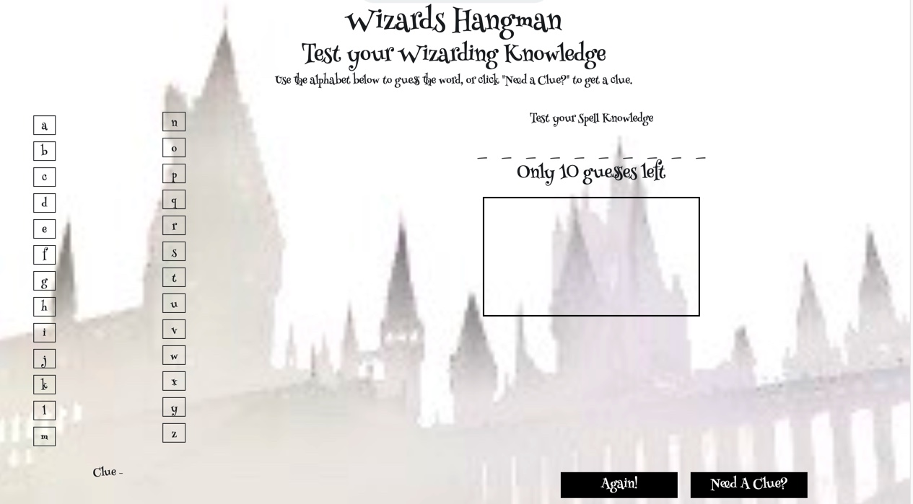

# Wizards Hangman

### General Assembly SEI 26- Project

* Trello board- https://trello.com/b/6EQUgK5S/project-1-planning

* Git hub- https://git.generalassemb.ly/bellajco/Hangman

* Link to deployed site- https://hopeful-galileo-892fac.netlify.com/

## Overview

The goal of this project was to use our skills in HTML, CSS and JavaScript to create a game that required manipulation of the DOM. I chose a themed game of Hangman based on the Wizarding world of Harry Potter. 

## Technology Used

* Languages- HTML5, CSS3, JavaScript, jQuery
* Design- Google Fonts, draw.io, wireframe cc
* Project Planning- Trello
* Visual Studio Code

Wireframe:

User Flow:

Final Product:
